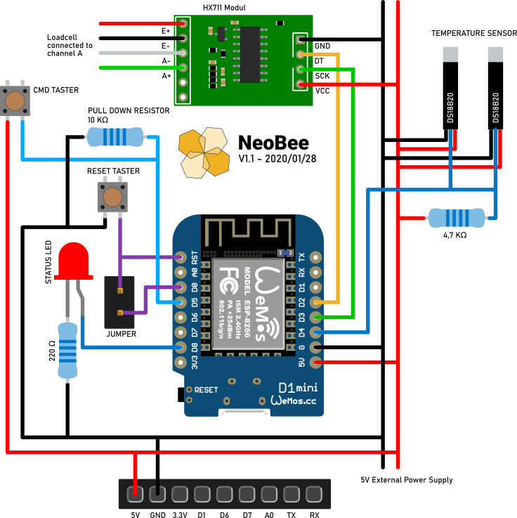

The Circuit
===========

THe following picture shows the circuit for the NeoBee hive logger.
I used two dallas 18b20 temperature sensors. One sensore to be used
inside of the hive and one sensore to be used outside of the hive.

The load cell is connected via the HX711 analog digital converter.
The status led gives some visual feedback in case of an error or to
signal, that we are in command mode.

When the command button is pressed during boot, the board will
enter the command mode.

To use the deep sleep funcinality, the pin `D0` has to be connected
to `GND`. But if done so, it is impossible to upload new firmware.
Therefore I integrated a jumper. So remove the jumper before flashing
and put it on afterwards.

